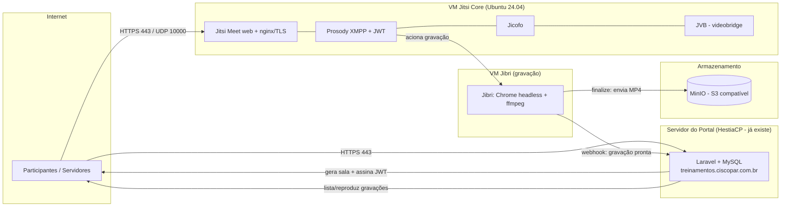

# Plataforma de Treinamentos + Reuniões — Integração Jitsi (self-hosted)

Plano de arquitetura e implantação para adicionar **videoconferência própria** (treinamentos
online e reuniões internas), com **gravação** e armazenamento no ambiente da CISCOPAR.

> Fonte da verdade do projeto Jitsi. A partir daqui construímos os scripts de instalação e a
> integração no app Laravel.

---

## 1. Objetivo e escopo

- Videoconferência **self-hosted** (Jitsi Meet) sob domínio próprio → soberania de dados (LGPD).
- Dois casos de uso na mesma plataforma:
  - **Treinamentos online** (já existe a modalidade Online no app).
  - **Reuniões** (novo tipo, ao lado de Treinamentos).
- **Gravação** das sessões (MP4) com armazenamento próprio e disponibilização no portal.
- Reuniões privadas com **autenticação por token (JWT)** emitido pelo app.

## 2. Decisões registradas

| Item | Decisão |
|------|---------|
| SO das VMs Jitsi | **Ubuntu 24.04 LTS (Noble)** |
| Domínio da videoconferência | `meet.ciscopar.com.br` |
| Hospedagem | **self-host** (não usar `meet.jit.si` em produção) — LGPD |
| Gravação | **incluída desde já** (Jibri + MinIO) |
| Autenticação de salas | **JWT** assinado pelo Laravel (secure domain) |
| App/portal | permanece no HestiaCP atual (Laravel + MySQL) |
| Hospedagem das VMs | **on-premise** (hypervisor da CISCOPAR) |

> **Sequência acordada:** (1) usuário cria as VMs on-premise → (2) instalar Jitsi Core → (3) instalar
> Jibri → (4) ajustar o código do portal para usar as VMs. O `install-*.sh` mira Ubuntu 24.04.

## 3. Arquitetura

**Papéis:**

- **Portal (Laravel)** — gera o nome da sala (a partir do `codigo` da sessão/reunião), assina o
  **JWT** por usuário, mostra o botão "Entrar", agenda, e registra as gravações prontas.
- **Jitsi Core** — Jitsi Meet (web+TLS), Prosody (XMPP + validação de JWT), Jicofo (orquestra) e
  **JVB** (retransmite o vídeo). No piloto o JVB fica na mesma VM.
- **Jibri** — grava/transmite. **1 gravação simultânea por instância**; VM separada obrigatória
  (usa dispositivos de áudio virtuais + Chrome + ffmpeg).
- **MinIO** — guarda os MP4 (S3 compatível, no ambiente próprio). Pode começar junto do app e
  virar VM própria depois.

## 4. Dimensionamento (piloto → médio)

| Componente | Piloto | Médio (100–200 simultâneos) |
|---|---|---|
| **Jitsi Core** (web+Prosody+Jicofo+JVB) | 4 vCPU / 8 GB / 25 GB | separar JVB: core 4/8 + 1–2 JVB de 4–8/8 |
| **Jibri** (por gravação simultânea) | 1× 4 vCPU / 8 GB | N× conforme gravações paralelas |
| **MinIO** | junto do app, disco conforme retenção | VM/volume dedicado |
| **Portal** | inalterado (HestiaCP atual) | inalterado |

- **Banda é o gargalo real:** ~1–2 Mbps por participante em vídeo.
- **Disco de gravação:** ~0,5–1 GB por hora gravada (dimensionar retenção no MinIO).

## 5. Rede, DNS e TLS

- **Domínio interno** (sem exposição à internet): `meet.ciscopar.com.br` no **DNS interno**
  (AD/servidor DNS) → **IP interno da VM Core**. A VM Jibri não precisa de nome/DNS.
- Portas Jitsi Core (rede interna): **TCP 443** (web), **UDP 10000** (mídia), TCP 4443 (fallback).
- Jibri → Core: XMPP na rede interna entre as VMs.
- **TLS: certificado Let's Encrypt wildcard `*.ciscopar.com.br`** (ECDSA), publicamente confiável,
  em `/opt/certificados/` na **Core** — `fullchain.pem` (cert + cadeia) + `cert.key` (chave),
  aplicados ao nginx. Como é cert público, o Chrome do Jibri já confia nativamente (sem trust store).
  Renovação a cada ~90 dias (DNS-01): recopiar os arquivos e recarregar o nginx.

## 6. Segurança, JWT e LGPD

- **Secure domain + JWT:** Prosody exige token válido para criar/entrar em sala. O Laravel assina o
  JWT (com o segredo compartilhado do app Jitsi), define **quem é moderador** e a validade.
- **LGPD / gravação:** avisar e ter base legal/consentimento dos participantes (o Jitsi exibe o
  aviso de "gravação iniciada"). Definir **política de retenção** e acesso às gravações.
- Dados de sala e gravações permanecem em infraestrutura própria (soberania).

## 7. Integração no app Laravel

Mudanças no portal (baixo impacto de carga — só gera links/tokens e registra gravações):

1. **Novo tipo `Reuniao`** (ou conceito compartilhado de "Sala online") ao lado de `Treinamento`.
2. **Geração de sala** determinística a partir do `codigo` + **assinatura de JWT** por usuário.
3. **Botão "Entrar na sala"** (público para treinamento aberto; com JWT para reunião privada).
4. **Modelo `Gravacao`** vinculado ao treinamento/reunião; endpoint que recebe o **webhook do
   finalize do Jibri** (gravação pronta → salva metadados + URL do MinIO).
5. **Agenda de reuniões** e listagem/reprodução das gravações no portal.

## 8. Fases de implantação

- [ ] **Fase 0 — Piloto de validação (grátis):** integrar `meet.jit.si` no app (sala por sessão +
      botão "Entrar") só para validar o fluxo de produto. *Sem infra.*
- [x] **Fase 1 — VM Jitsi Core:** `jitsi/install-jitsi.sh` (Jitsi Meet + Prosody + Jicofo + JVB +
      TLS + JWT) em Ubuntu 24.04. **Concluída** — funciona interno e externo.
- [x] **Acesso externo (1 IP público):** proxy nginx no HestiaCP (`jitsi/hestia/`) para o 443 +
      DNAT de UDP 10000 / TCP 4443 direto para a VM + NAT harvester do JVB + Cloudflare DNS-only.
      Ver `jitsi/hestia/README.md`.
- [x] **Fase 2 — Gravação:** `enable-recording-core.sh` (Core) + `install-jibri.sh` (VM Jibri).
      **Concluída** — grava `.mp4` em `/srv/recordings`. Travas resolvidas: detector jibri no
      Jicofo; módulo Lua `inspect` no 5.4; `token_verification_allowlist` para o recorder (JWT).
- [x] **Fase 2b + Fase 3 (portal) — Concluídas.** Portal Laravel expandido para treinamentos +
      reuniões online: SMTP configurável, convite/ativação de gestor, JWT + "Criar sala"
      (gestor=moderador, participantes por link único) e **gravação → e-mail** (webhook do Jibri →
      `Gravacao` → link de download assinado; arquivo servido do Jibri via nginx `/rec` e streaming
      pelo portal). O `finalize.sh` chama o webhook; sem MinIO (arquivo permanece no Jibri).

### Scripts (em `jitsi/`)

| Script | Onde roda | O quê |
|---|---|---|
| `install-jitsi.sh` | VM Core | Jitsi Meet + Prosody + Jicofo + JVB, TLS e JWT |
| `enable-recording-core.sh` | VM Core | Contas Prosody do Jibri, domínio do gravador, Jicofo brewery |
| `install-jibri.sh` | VM Jibri | Chrome/chromedriver, ffmpeg, snd-aloop, pacote jibri, `jibri.conf` |
| `finalize.sh` | VM Jibri | Pós-gravação: envia MP4 ao MinIO e notifica o portal |
| `jitsi.conf.example` | — | Modelo de config compartilhado (copiar p/ `jitsi.conf`) |

> **Ordem:** `install-jitsi.sh` → `enable-recording-core.sh` (Core) → `install-jibri.sh` (Jibri).
> Use o mesmo `jitsi.conf` (DOMAIN + as duas senhas do Jibri) nas duas VMs.
- [ ] **Fase 3 — Integração completa no portal:** `Reuniao`, `Gravacao`, JWT, agenda e player.
- [ ] **Fase 4 — Endurecimento:** retenção, backups, monitoramento, e escala de JVB/Jibri conforme uso.

## 9. Checklist de pré-requisitos (você / infra CISCOPAR)

- [ ] Definir **onde** rodam as VMs (nuvem BR ou on-premise).
- [ ] Criar **VM Jitsi Core** (4 vCPU / 8 GB / 25 GB / Ubuntu 24.04 / IPv4 público).
- [ ] Criar **VM Jibri** (4 vCPU / 8 GB / Ubuntu 24.04).
- [ ] Registro DNS `meet.ciscopar.com.br` → IP da Core.
- [ ] Abrir portas (UDP 10000, TCP 443/4443) no firewall.
- [ ] Acesso SSH para execução dos scripts (ou executar você mesmo, guiado pelo runbook).

## 10. Custos aproximados

- **Piloto (Fase 0):** R$ 0 (`meet.jit.si`).
- **Self-host médio:** VMs (Core + Jibri) ≈ **R$ 200–500/mês** em VPS BR conforme banda/gravações,
  ou custo interno se on-premise. MinIO usa disco próprio.

---

*Próximo passo sugerido: começar pela **Fase 0/1** — a Fase 0 valida o produto sem custo enquanto a
VM da Fase 1 é provisionada.*
